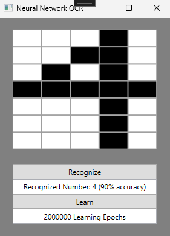

# NeuralNetwork
Simple Neural Network PoC for Number Recognition

Based on [this](https://www.codeproject.com/articles/Neural-Network-OCR#comments-section) article by Andrew Kirillov

Made with WPF and .Net Framework 4.7.2

# Example
The input is a grid of pixels that can be toggled to draw a number

If the recognize button is pressed, the neural network will try to identify the number and display its result and accuracy

The learning button can be used to train the neural network to improve its results

When starting the program, the neural network isn't trained at all by default to showcase its initial state

